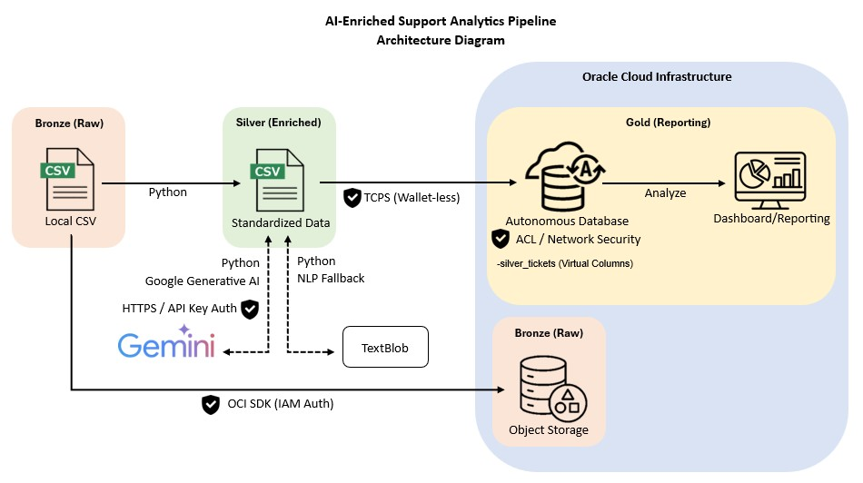

# AI-Enriched Support Analytics Pipeline
> **A Principal-Grade Data Architecture Project**

## 🚀 Project Overview
This project transforms 1,000 raw support tickets into an AI-powered analytical dashboard. It demonstrates a full **Medallion Architecture** using Oracle Cloud Infrastructure (OCI) and Generative AI.

## 🏗️ Architecture

* **Bronze Layer:** Raw data ingestion to OCI Object Storage.
* **Silver Layer:** AI Enrichment using **Gemini 3 Flash Preview** with a local **TextBlob fallback**.
* **Gold Layer:** Real-time SLA reporting in **Oracle Autonomous Database** via Virtual Column.

## 🛠️ Tech Stack
* **Language:** Python (Pandas, OCI SDK, Google-GenAI SDK)
* **AI:** Gemini 3 Flash & TextBlob
* **Database:** Oracle Autonomous Database 26ai
* **Cloud:** Oracle Cloud Infrastructure (OCI)

## 🎓 Credentials
This project applies the skills earned from my 2026 certifications:
* **Oracle Cloud Infrastructure 2025 Generative AI Professional**
* **Oracle Autonomous Database 2025 Professional**

## 🛡️ Security & Resiliency
* **API Security:** Implemented API Key-based IAM authentication.
* **Network Security:** Database access restricted via **IP-based ACLs**.
* **Rate-Limit Handling:** Managed **HTTP 429 errors** from Gemini 3 via exponential backoff and 4-second delays.

## 📂 Folder Structure
* `/scripts`: Python ETL and AI Enrichment scripts.
* `/sql`: Database schema and Virtual Column DDL.
* `/data`: Truncated sample dataset (10 records).
