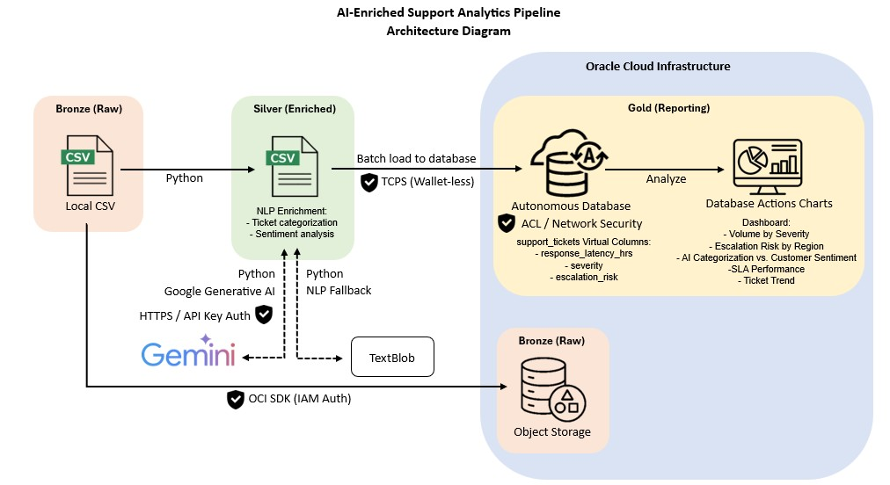
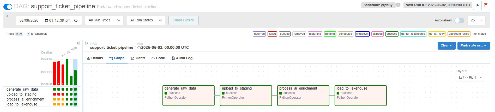
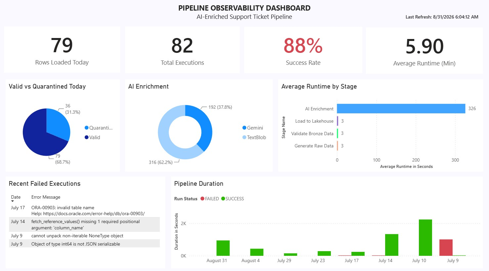
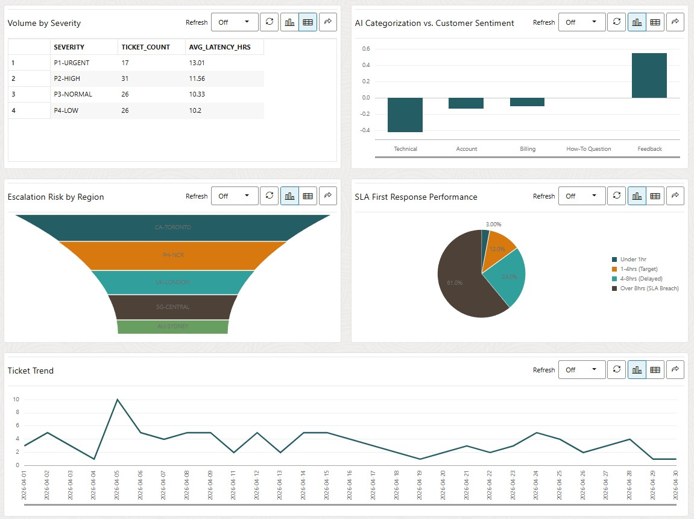

# AI-Enriched Support Analytics Pipeline
> **Production-Inspired Data Engineering Pipeline with Apache Airflow, OCI, Gemini AI & Oracle Autonomous Database**

## 🚀 The Mission
Modern support teams are often overwhelmed by ticket volume, leading to missed SLAs and customer churn.

This project demonstrates a **production-inspired, metadata-driven data engineering pipeline** that transforms raw support tickets into analytics-ready datasets through automated data quality validation, AI enrichment, and dimensional modeling.

The pipeline follows the **Medallion Architecture (Bronze → Silver → Gold)** and is orchestrated using **Apache Airflow** on **Oracle Cloud Infrastructure (OCI)**.

Beyond business analytics, the project also implements **operational metadata**, enabling execution tracking, audit logging, configuration management, and pipeline observability similar to enterprise ETL platforms.

---
## ✨ Key Features

- 🟧 Bronze → Silver → Gold Medallion Architecture
- ✅ Automated data quality validation with quarantine
- 🤖 AI-powered enrichment using Google Gemini
- 🔄 Automatic TextBlob fallback for resiliency
- 📊 Star schema data warehouse
- 📈 Metadata-driven pipeline monitoring
- 📝 JSON execution metrics for every stage
- ☁️ OCI Object Storage integration
- 🛠 Apache Airflow orchestration
- 🔍 End-to-end execution lineage

---

## 🏗️ Architecture & Data Flow
The project follows a metadata-driven Medallion Architecture (Bronze → Silver → Gold).

Each stage performs a specific responsibility—from raw data generation and validation to AI enrichment and dimensional loading into the analytics warehouse.

---

## 🌬️ Airflow Orchestration

Apache Airflow orchestrates the end-to-end workflow by managing task dependencies, execution order, retries, and monitoring.

---

## 🛠️ Tech Stack & Credentials
Built by a certified **OCI 2025 Generative AI Professional** and **Autonomous Database Professional**.

* **Orchestration:** Apache Airflow
* **AI/LLM:** Gemini 3 Flash Preview (Primary) & TextBlob (Local NLP Fallback)
* **Cloud:** Oracle Cloud Infrastructure (OCI)
* **Database:** Oracle Autonomous Lakehouse 26ai
* **Storage:** OCI Standard Object Storgae
* **Language:** Python 3.11 (Pandas, OCI SDK, Google-GenAI SDK)
* **Visualization:** Power BI, OCI Charts
* **Development:** Git, GitHub, VS Code, WSL

---

## 📊 Analytics & Reporting

### Pipeline Observability

Monitors pipeline execution health, stage performance, validation results, AI enrichment usage, runtime trends, and failed executions.

### Business Analytics

Provides insights into support ticket volume, sentiment, categorization, and SLA performance that helps identifies operational bottlenecks.

---

## 📂 Project Structure
* `/dags`: Apache Airflow DAGs for orchestrating the end-to-end pipeline.
* `/src/pipelines`: Core pipeline stages for data generation, validation, AI enrichment, and loading.
* `/src/utils`: Shared utilities for OCI Object Storage, Oracle database access, and operational metadata.
* `/assets`: Architecture diagrams, database schema, and dashboard screenshots.
* `/sql`: Database DDL, reference tables, metadata tables, and reporting queries.
* `/data`: Local raw, temporary, and enriched datasets used during development and testing.

---

## 🎓 Author
**Junie Rose** *Principal Technical Support Engineer | Data Engineer* *Specializing in OCI Data Management & Generative AI Solutions.*
